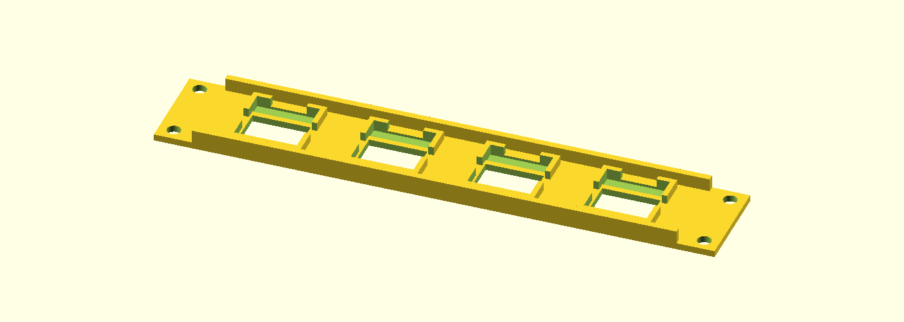
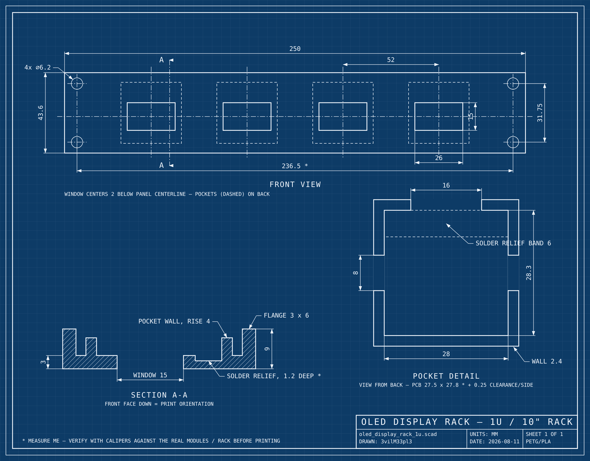
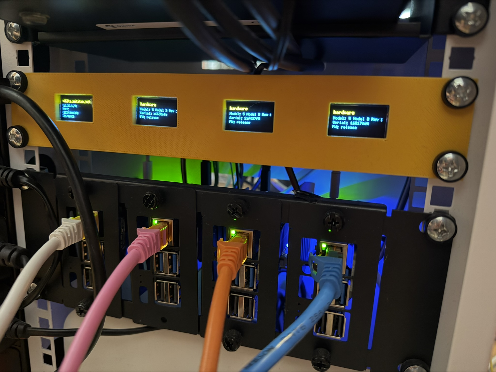

# 10-Inch Rack OLED Panel

A 3D-printable 1U faceplate for a 10-inch rack. It holds four small
[OLED display modules](https://www.amazon.co.uk/dp/B0FKLXL3DY?th=1) behind neat
windows; each module drops into a screwless pocket on the back and is held with
a strip of tape.

Every measurement is on this drawing (click for the full-size version):

## Installed in a rack

The finished panel installed with four OLED status displays.

## Files

- `oled_display_rack_1u.scad` — the parametric OpenSCAD model.
- `oled_display_rack_1u.3mf` — the print-ready panel.
- `oled_display_rack_1u_coupon.3mf` — a small fit-check coupon.
- `oled_display_rack_1u_blueprint.svg` / `.png` — the dimensioned drawing.

## Printing

1. Open `oled_display_rack_1u.3mf` in a slicer such as
   [PrusaSlicer](https://www.prusa3d.com/prusaslicer/) or
   [Cura](https://ultimaker.com/software/ultimaker-cura).
2. Print in PLA or PETG without supports; the panel is designed to print flat.
3. Print the coupon first to verify your OLED modules and rack rails before
   committing to the full panel.

## For tinkerers

The model is written in [OpenSCAD](https://openscad.org). Dimensions are named
parameters near the top of `oled_display_rack_1u.scad`; values marked
`MEASURE ME` should be checked against your modules and rack rails. Run
`make blueprint` to regenerate the technical drawing from the model's
parameters.

## License

[CC BY 4.0](LICENSE) — you may use, adapt, print, and sell this design. Please
credit **3vilM33pl3** and link back to this repository.
