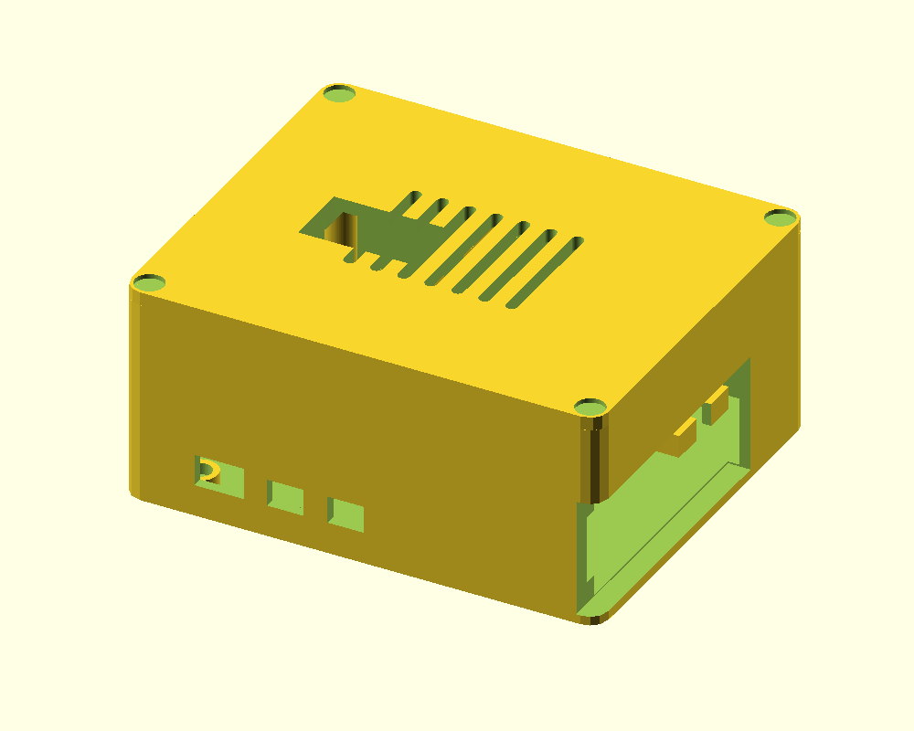

# Homelab 3D Prints

3D-printable parts for a small (10-inch) home server rack: a protective case for a
Raspberry Pi mini-computer and a front panel that holds four little status screens.

## What's in here

### A security box for a Raspberry Pi 5

The Raspberry Pi in this case is the *certificate authority* of a home network —
the small computer that vouches for the identity of every other machine in the
house. That makes it worth protecting, so this case is built for it:

- It encloses the Pi together with its cooler, an SSD (storage) board stacked on
  top, and a small screen in the lid that shows status information.
- Inside there is a spot for a **motion sensor, rigidly glued to the case**. Like
  the sensor in an ATM, it notices when the box is picked up or moved — and the
  Pi can then lock itself down. The wiring and behaviour are described in
  [rpi5_ca_tamper_lockdown_spec.md](rpi5_ca_tamper_lockdown_spec.md).
- The Pi can be bolted through the floor of the case into the metal pillars of
  the SSD board, so the whole stack becomes one solid unit.

Files: `rpi5_ca_case.scad` (the model), ready-to-print parts come out of the
`Makefile` (see "For tinkerers"). There is also an older, simpler Pi 5 rack case
in `rpi5_case.scad` / `rpi5_case.3mf`.

### A panel with four tiny screens

A faceplate for the rack that holds four small OLED displays (the kind you find
in DIY electronics kits) behind neat windows. Each display simply drops into a
pocket on the back and is held with a strip of tape — no screws.

Every measurement is on this drawing (click for the full-size version):

Files: `oled_display_rack_1u.scad`, print-ready `oled_display_rack_1u.3mf`.

## I just want to print these

1. Download the `.3mf` file of the part you want.
2. Open it in a slicer program ([PrusaSlicer](https://www.prusa3d.com/prusaslicer/),
   [Cura](https://ultimaker.com/software/ultimaker-cura), …).
3. Print in PLA or PETG. No support material is needed — the parts are designed
   to print flat.
4. Where a small **coupon** file exists (a thin slice of the real part), print it
   first: it takes minutes and lets you check that everything fits your hardware
   before committing to the multi-hour full print.

## For tinkerers

The models are written in [OpenSCAD](https://openscad.org) — every dimension is a
named parameter near the top of each `.scad` file, with `MEASURE ME` marking the
values you should verify with calipers against your own hardware. `make all`
builds STLs, `make png` renders previews, and `make blueprint` regenerates the
technical drawing directly from the model's parameters (`make_blueprint.py`), so
the drawing always matches the model. `homelab_lib.scad` holds the reusable
pieces (standoffs, heat-set bosses, vents, pockets).

## License

[CC BY 4.0](LICENSE) — you may use, adapt, print, and even sell these designs.
Just credit **3vilM33pl3** and link back to this repository.
